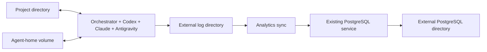

# Docker deployment and external runtime storage

Date: 2026-09-17. Status: implementation plan; all subtasks are pending.

This is working material, not a specification. Saving this plan does not migrate data or change running services.
Implementation must follow the repository's authoritative documentation and the
[development conventions](../.agents/skills/develop/SKILL.md).

## Confirmed requirements

- Run the orchestrator and Codex, Claude Code, and Antigravity (`agy`) together in a Docker container.
- Use account/subscription logins for all three agent CLIs and preserve login and conversation state across restarts.
- Keep the existing permission-bypass behavior. The security objective is protecting the rest of the host;
  credentials and files available inside the container are within the accepted trust boundary.
- Supply `GITHUB_TOKEN` at container startup, for example through `docker run --env GITHUB_TOKEN` with the variable
  already exported. Do not bake credentials into an image.
- Mount one chosen project directory, potentially `~/git`, for development. Everything accessible under that mount
  is available to agents, including sibling repositories and uncommitted changes.
- Reuse the PostgreSQL service already running in Docker on the same machine.
- **First move database and log-related runtime data out of `~/git/chipping-orchestrator/`.** Put it outside `~/git`
  altogether so mounting that project tree cannot expose the database or its backups.

## Target layout

The following names are proposed deployment defaults, not settings that already exist in the application.
Resolve host paths to absolute paths in deployment configuration; do not rely on application-side `~` expansion.

```text
~/.local/state/chipping-orchestrator/
  postgres/       PostgreSQL data; mounted only by the database container
  logs/           Runtime logs, JSONL sinks, rotations, and maintenance-job output
  backups/        Database dumps, archived logs, and migration/rollback records

~/.config/chipping-orchestrator/
  deployment.env  Host paths and non-secret deployment settings
  analytics.env   Database settings for the database, sync, and existing dashboard as needed

<chosen-project-directory>/
  <repo>/         Target clone, including its Git common directory
  wt-orchestrator/ Persistent issue worktrees

Docker external named volume:
  chipping-orchestrator-agent-home  Dedicated /home/agent, including account and session state
```

Use a dedicated project directory if practical; `~/git` remains a supported choice after the storage migration.
The Docker engine's own data root and the agent-home volume must also be outside the mounted project tree.

| Container | Mounts | Credentials and network access |
|---|---|---|
| Orchestrator and agents | Project tree RW, external logs RW, agent-home volume RW | GitHub and agent accounts |
| Analytics sync | External logs RO; optional separate location for its own output | Database credentials, DB network |
| Existing PostgreSQL | External PostgreSQL directory; schema source RO if retained | Existing database identity |

Moving logs out of the project requires a **second, narrowly scoped host bind for logs**, in addition to the one
project-directory bind. This is an explicit adjustment to the earlier layout that put logs under `/workspace`.
Mount only the `logs/` leaf into the agent container, never the complete state directory, `postgres/`, `backups/`,
host home, host keyring, or deployment configuration directory. A log named volume is an alternative only if exactly
one host bind in total becomes a requirement; the plan below uses the explicit external log directory.

Keep the existing database Compose project independently managed. The new deployment joins its database network
only from the analytics sync service. The polling loop never requires PostgreSQL.



## Subtasks and order

| ID | Deliverable | Depends on | Approximate scope, including tests and documentation |
|---|---|---|---|
| 1 | External runtime storage and verified migration | None; must finish first | Medium, about 7-10 files |
| 2 | Reproducible image containing the orchestrator and all three CLIs | 1 | Medium, about 4-6 files |
| 3 | Persistent subscription authentication and session bootstrap | 2 | Medium, about 4-6 files |
| 4 | Hardened orchestrator deployment and controlled host cutover | 3 | Medium, about 5-8 files |
| 5 | Containerized analytics sync using the existing PostgreSQL network | 4 | Small/medium, about 3-5 files |

**The operational migration in subtask 1 is a release gate, not just a merged configuration change.** Do not start
the later implementation/deployment steps until its acceptance criteria hold. Host-side operation can resume on the
external storage while the remaining subtasks are implemented.

These are planning estimates, not issue-size exemptions. Reassess completion scope when creating implementation
issues. Each subtask includes its own tests, consequent documentation, and final documentation pass as required by
the [decompose skill](../.agents/skills/decompose/SKILL.md). There is no separate checks-only or documentation-cleanup
subtask. Together they cover the parent; no residual parent implementation is planned.

## 1. Move database and log data outside the checkout

**Unique deliverable:** the existing host deployment continues working with all database persistence and log-related
data outside the project tree, with a verified rollback path. This is independently useful before containerizing
the orchestrator.

### Changes

- Parameterize the database data bind with an explicit absolute deployment path, such as `POSTGRES_DATA_DIR`.
  Preserve long-form mounts and `create_host_path: false`; a missing or incorrect source must fail rather than
  create a new empty database. A path outside the entire project mount is required for this deployment.
- Keep database name, roles, permissions, schema, extensions, and the current PostgreSQL major version intact.
  Determine the running version during migration; `analytics-db/compose.yml` currently specifies `postgres:16`.
  A PostgreSQL upgrade is outside this subtask.
- Set the existing host launcher's `LOG_DIR` to the external log directory. Relocate explicit
  `ANALYTICS_LOG_PATH`, `EVENT_LOG_PATH`, and `TRAJECTORY_LOG_PATH` overrides when configured. Preserve disabled sinks
  and retention settings; relocation must not turn optional recording on.
- Include rotated `orchestrator.log` files, analytics/audit/trajectory JSONL files, archives, sync cron output,
  trajectory mirror/prune output, and any existing dashboard or maintenance output written beneath the checkout.
  Inventory configured writers and readers without printing file contents or secrets.
- Update the existing systemd/cron/manual launch configuration, dashboard inputs, mirror jobs, retention jobs, and
  backup paths together. Keep deployment credentials outside the project tree using explicit environment files.
- Prefer deployment overrides for the already-supported log paths. Changing global application defaults is not
  required to migrate this installation; preserve compatibility for other host deployments.
- Keep tracked Compose files and schema SQL in the repository. Runtime data and credentials move out.

### Migration procedure to implement and document

1. Record the running database version, container/project identity, network, bind configuration, and all configured
   log consumers. Query the database through PostgreSQL clients; do not inspect its raw files.
2. Schedule downtime, stop the host poller and all log/database writers, and drain agent subprocesses. Suspend sync,
   prune, mirror, and rotation jobs during the copy so files and database comparison counts remain stable.
3. Take a logical database backup into the external backup directory, including required roles/grants. Verify the
   backup command succeeds and retain it through cutover. Use `pg_dump` with globals or an appropriate `pg_dumpall`
   workflow; account for any additional databases and tablespaces before choosing the restore procedure.
4. Restore into a separate destination using the external PostgreSQL path and the same major version. Keep the
   source intact. Fail on restore errors, handle bootstrap-role conflicts explicitly, and avoid replaying schema
   initialization over a restoration in a way that hides failures.
5. Compare schema objects, roles/grants, table counts, and representative analytics/content hashes. Refresh and
   check the materialized rollup and existing dashboard queries. Run a controlled sync replay to confirm deduplication.
6. Copy the stopped log streams and their rotations to the external log directory; compare sizes/checksums and
   preserve suitable ownership and permissions. Archive migration evidence outside the workspace.
7. Recreate the database container with the new bind configuration and switch consumers to the migrated service.
   A container restart alone does not change its saved bind source. Verify mount metadata and SQL health before
   resuming the host poller and scheduled jobs.
8. Verify fresh records go to the external locations. The operator relocates any retired raw database directory and
   remaining log copies outside the future project mount after validation. Retain rollback material outside that
   mount until the agreed retention period ends; do not replace paths with symlinks into the external state tree.

The repository explicitly makes `analytics-db/data/` off limits to agents. Raw-volume preparation, physical handling
of the retired directory, and any ownership work belong to the operator. Do not provide an agent-run recursive
copy, scan, `chown`, deletion, or elevated retry against that directory. Use the database protocol for logical
backup/verification and synthetic directories for automated tests. This plan does not authorize an agent to perform
the live migration.

**Rollback:** keep the source service and logical backup recoverable until destination validation passes. Before
new writes, restore the previous endpoint/configuration if necessary. After new writes, first quiesce writers and
preserve/reconcile destination changes; blindly switching to the stale source would lose data. A rollback that
temporarily restores checkout-local storage also closes the Docker deployment gate.

**Likely owners/files:** `analytics-db/compose.yml`, `analytics-db/.env.example`, `.env.example.advanced`,
`tests/repository/test_analytics_compose.py`, `docs/observability/analytics-database.md`,
`docs/configuration/observability.md`, `docs/configuration/operations.md`, and applicable examples in
`docs/observability/trajectories.md` and `docs/security.md`. Update operator service files outside the repository
during the migration. Amend `AGENTS.md` only if its operator-data safety routing must cover the new storage location;
keep the prohibition on the legacy path while it can still exist.

**Acceptance and verification:**

- The existing deployment works against the relocated database and logs; validated backup and rollback records exist.
- Neither active nor retired database/log data remains under the chosen project mount before the gate opens.
  Operator confirmation covers the protected raw data directory; agents do not traverse it to prove absence.
- Missing external bind sources fail safely, and database access remains restricted to its intended clients.
- Update the Compose-rendering test to assert the external source and no automatic source creation. Run it against
  a copied Compose file and temporary paths, never the operator directory.
- Verify explicit log paths and inherited analytics paths using existing configuration/logging tests if changed.
  Include a restore rehearsal on disposable data and an operator-verified live migration; a successful config render
  alone does not establish data preservation.

## 2. Build the image with the orchestrator and all three CLIs

**Unique deliverable:** a versioned Linux image that can run the orchestrator, `codex`, `claude`, and `agy`, and the
development tools needed by the target projects. It remains a usable image independently of the production Compose
service and login bootstrap supplied by later subtasks.

### Changes

- Add a Dockerfile with a supported Python 3.12+ base, Git, CA certificates, shell, `rg`, and the required project
  build/test tools. Install Python dependencies from `uv.lock`. Justify any additional OS package needed by a CLI.
- Pin compatible CLI releases and record image provenance. Antigravity has a native Linux CLI; a desktop IDE is
  not required for its current headless backend. Verify supported architecture and runtime libraries for each binary.
- Separate the common Python runtime build stage from the agent tooling so the sync service can reuse a smaller
  target without account credentials. Keep optional dashboard dependencies out unless an existing consumer needs them.
- Use an allowlisted build context and `.dockerignore`; exclude `.git`, `.env` files, local virtualenvs, logs,
  database data, backups, and authentication/session state. Do not use a broad context copy that can include them.
- Install executable tools outside the persistent agent home so mounting an empty home does not hide binaries.
  Provide a non-root account and an explicit UID/GID strategy for the host's writable project and log directories.
- Start the installed orchestrator directly. Image upgrades rebuild/recreate the container; `run.sh`'s checkout
  pull/restart behavior is not the container update mechanism. Keep the image's runtime source free of `.git` so the
  self-update probe cannot create an exit/restart loop against an immutable checkout.

**Likely owners/files:** new `Dockerfile`, `.dockerignore`, a focused test under `tests/repository/`, `README.md`,
and `docs/configuration/operations.md`. Reuse `tests/runtime/test_self_update.py` if runtime behavior needs adjustment.
Avoid an application change when packaging without Git metadata already satisfies the requirement.

**Acceptance and verification:** build without secrets, run all CLI help/version commands and orchestrator help,
verify the effective user and build tools, and inspect an image built from a synthetic context for excluded sentinel
files. Verify the installed orchestrator does not depend on a writable source checkout or start its source-update
loop. These checks do not claim authenticated agent execution; that belongs to subtask 3.

## 3. Bootstrap and preserve subscription logins

**Unique deliverable:** an interactive setup entrypoint and persistent state arrangement that make all three account
logins usable for unattended agent runs after container replacement.

### Changes

- Provision a dedicated, explicitly named external Docker volume for `/home/agent`, with suitable ownership.
  Preserve credentials, conversation histories, project indexes, and caches. Keep the volume through rebuilds and
  routine Compose teardown; document backup and reauthentication without exposing credential contents.
- Provide a setup mode that starts the required local services and opens an interactive shell as the same user,
  with the same home and project paths as the eventual daemon. Setup must not launch the polling loop.
- Codex: use account login, preferably device authentication, and file-backed credential storage under its home.
  Keep the cache writable so refreshed credentials persist.
- Claude Code: use its subscription login and browser URL/code flow. Preserve the complete dedicated home, including
  configuration outside `~/.claude`, rather than copying only one credential file.
- Antigravity: provide a container-local D-Bus session and unlocked credential store as required by the installed
  CLI. Define and test keyring creation, persistence, unlocking after restart, and a login flow usable from the
  operator's host browser. Do not mount the host session bus, keyring, or browser profile.
- Make bootstrap failures actionable. Preserve state and request reauthentication when required; do not silently
  fall back to API billing. The earlier `GEMINI_API_KEY` filtering observation needs no change for this account-only
  design.
- Decide how CLI self-updaters are disabled or constrained so the tested releases remain consistent with the image.
  Verify the chosen mechanism against each installed release rather than assuming a shared setting.

**Likely owners/files:** new bootstrap/entrypoint scripts under a deployment directory such as `docker/`, Dockerfile
additions for the credential store, focused bootstrap tests under `tests/repository/`, and the authentication section
of `docs/configuration/operations.md`. Consult `orchestrator/agents/backends/`, `agents/environment.py`, and
`docs/workflow/command-specs.md`; change those only if a demonstrated container integration requires it.

**Acceptance and verification:** authenticate all three accounts, run a minimal headless request with each backend,
recreate the container using the same volume, and verify another request and conversation resumption. Specifically
exercise Antigravity's keyring startup after recreation and document credential refresh/reauthentication behavior.
Automated tests use fake CLIs and temporary homes; subscription credentials never enter the repository or CI.
Manual provider checks are part of this subtask, not a later checks-only task.

## 4. Deploy the hardened orchestrator and switch from the host process

**Unique deliverable:** a Compose service and operator workflow that run the authenticated image with constrained
host access, correct worktree paths, predictable shutdown, and controlled image upgrades.

### Changes

- Add the orchestrator Compose service with explicit project/log binds, the external agent-home volume, a non-root
  user, `init: true`, a restart policy, and a shutdown grace period appropriate for agent process-group teardown.
- Set a read-only root filesystem, `cap_drop: [ALL]`, `no-new-privileges`, and the default seccomp profile. Provide
  only the writable tmpfs/runtime paths actually needed by Python, build tools, D-Bus, and the credential store.
- Set configurable CPU, memory, PID, tmpfs, and Docker-log rotation limits. Set a workspace/cache disk quota or use
  bounded storage where needed; memory/PID limits do not bound writes to a host bind or named volume.
- Keep host PID/IPC/network namespaces, Docker sockets, host devices, SSH agents, and host home out of the service.
  Projects whose tests require Docker need a separate future design; do not weaken the production profile for them.
- Use an isolated bridge and an operator-owned outbound policy that blocks unintended access to host and LAN
  services while allowing provider authentication/inference, GitHub, DNS, and required package registries. Cover
  IPv4/IPv6 and traffic addressed to the host itself as well as forwarded traffic. Keep firewall administration
  outside the agent container and document rule installation, verification, and rollback for the actual host.
- Pass `GITHUB_TOKEN` from the launch environment by name, with a missing-token failure. Inject only needed settings;
  do not pass the database environment file wholesale to this service. Existing child-environment filtering stays.
- Use absolute container paths for `TARGET_REPO_ROOT` or each `REPOS` entry, `WORKTREES_DIR`, `LOG_DIR`, and enabled
  JSONL sinks. Suggested log paths are `/var/log/orchestrator/` and worktrees beneath `/workspace/`.
- Keep the clone's Git common directory and every managed worktree visible. Worktree metadata can contain absolute
  paths: use stable identical host/container paths for an existing layout, or perform a deliberate migration and
  repair before using `/workspace`. Do not assume a relocated worktree remains usable on both host and container.
- Recreate the image for upgrades and retain the previous image for rollback. Keep the host `run.sh` workflow for
  non-container deployments. The baseline uses the existing Docker daemon; rootless Docker remains an optional
  follow-up because a separate daemon changes UID mappings and connectivity to the existing database network.

### Cutover

Stop and disable the host polling service before starting the container. Avoid concurrent orchestrators even if
their worktree locks happen to differ. Preserve GitHub pinned state, clone/worktree contents, and required CLI
conversation histories. Fresh account logins alone do not import histories from the host.

Prefer switching after active conversations have finished. If unfinished issues must carry over, migrate only the
required backend state and verify their pinned session IDs and paths before cutover; otherwise continue on the host
until they can finish. Do not clear pinned session fields or discard dirty worktrees to force startup.

Start against a disposable target repository first, then enable the intended repositories. Restarting and rolling
back the image must preserve worktrees, external logs, credentials, and session discovery. Rollback also stops the
container before any host poller is enabled.

**Likely owners/files:** new root/deployment Compose file, deployment environment example, bootstrap/preflight
scripts, focused Compose/lifecycle tests under `tests/repository/`, `docs/configuration/operations.md`,
`docs/security.md`, and `README.md`. Extend `tests/runtime/` or `tests/agents/` only for actual behavior changes.

**Acceptance and verification:** render Compose with synthetic values; inspect mounts, UID, capabilities, namespaces,
and limits; verify permitted writes and failure to access harmless sentinel files outside the mounts. Exercise
shutdown with an agent and descendant process, restart/session recovery, missing-path/credential diagnostics, and
worktree create/commit/test operations. Test host/LAN/database reachability restrictions from inside the container,
including host-published ports; an isolated bridge or absent published ports alone is not proof of outbound isolation.

## 5. Run analytics sync against the existing PostgreSQL service

**Unique deliverable:** a schedulable container invocation that imports external analytics logs into the already
migrated database without coupling its availability or credentials to the polling loop.

### Changes

- Add a separate, on-demand sync service using the runtime image target and the existing
  `python -m orchestrator.observability.analytics.sync.cli` entrypoint. Keep the database in its existing Compose
  project; this service must not provision a second production database or alter its storage lifecycle.
- Reference the database's existing Docker network as external. Resolve its service/network alias on port `5432`,
  rather than the sync container's `localhost` or the host's published port. Verify a stable unambiguous alias.
- Mount the external log directory read-only and set `ANALYTICS_LOG_PATH` explicitly. Give `ANALYTICS_DB_URL` only
  to sync and existing dashboard consumers. Do not mount provider credentials, project clones, or the agent home.
- Provide an operator-run cron/systemd invocation with non-overlap protection, a chosen interval, exit-status
  visibility, and output outside the checkout. A host scheduler may call Docker; the agent container gets no Docker
  control socket. A stopped database must produce a visible sync failure without stopping the orchestrator.
- Keep existing dashboard deployment working against the same database. Update any file-backed trajectory viewer
  to use the external trajectory path; creating new dashboards is outside scope.

**Likely owners/files:** the deployment Compose file, a scheduling example or small launcher, focused tests under
`tests/repository/`, `docs/configuration/observability.md`, and `docs/observability/analytics-database.md`.
Reuse existing `tests/observability/analytics/sync/` coverage for ingestion semantics; do not rewrite the importer.

**Acceptance and verification:** with disposable database/log fixtures, show new records are imported, replay is
idempotent, the rollup/dashboard remains readable, source logs cannot be modified by sync, and overlapping scheduled
runs are prevented. Verify database outages affect only sync. Check actual mounts and environment variable names
without printing credentials. Confirm production scheduling uses the relocated storage established in subtask 1.

## Completion and validation policy

Each implementation subtask owns the distinct checks above and its mechanically consequent documentation. Follow
the development skill's required lint, formatting, and full test gates before committing code changes. Keep
Docker-dependent checks explicit about skips and use disposable fixtures, never the operator's PostgreSQL volume.

The complete deployment is ready when external-storage migration is verified, every CLI can authenticate and resume
after recreation, the host-boundary probes pass, only one poller is active, and analytics reaches the existing
database through the independent sync service. Record the tested image/CLI versions and outstanding provider-specific
limitations in the operator documentation. Containers share the host kernel; the documented boundary is containment
of ordinary agent processes, not a guarantee against kernel/runtime vulnerabilities.

This plan changes neither workflow labels nor pinned JSON/comment/event contracts. Per-agent containers, an agent
credential broker, API-key authentication, a PostgreSQL version upgrade, and a new external orchestration platform
are outside scope.

## References checked during discussion

- Repository: [architecture](../docs/architecture.md), [workflow](../docs/workflow.md),
  [configuration](../docs/configuration.md), and [security](../docs/security.md).
- [PostgreSQL logical backup and restore](https://www.postgresql.org/docs/16/backup-dump.html).
- [Docker bind mounts](https://docs.docker.com/engine/storage/bind-mounts/),
  [Compose service controls](https://docs.docker.com/reference/compose-file/services/),
  [external volumes](https://docs.docker.com/reference/compose-file/volumes/), and
  [existing Docker networks](https://docs.docker.com/compose/how-tos/networking/#use-an-existing-network).
- [Docker network filtering](https://docs.docker.com/engine/network/packet-filtering-firewalls/) and
  [rootless mode](https://docs.docker.com/engine/security/rootless/).
- [Codex account authentication and storage](https://learn.chatgpt.com/docs/auth).
- [Claude Code account authentication and Linux credential storage](https://code.claude.com/docs/en/authentication).
- [Antigravity account authentication](https://antigravity.google/docs/cli/install),
  [headless execution](https://antigravity.google/docs/cli/headless/), and
  [Linux keyring troubleshooting](https://antigravity.google/docs/cli/troubleshooting/).

The authentication sources establish available mechanisms. They are not evidence that the proposed image's
Antigravity keyring/bootstrap flow has been tested; that remains an explicit deliverable of subtask 3.
